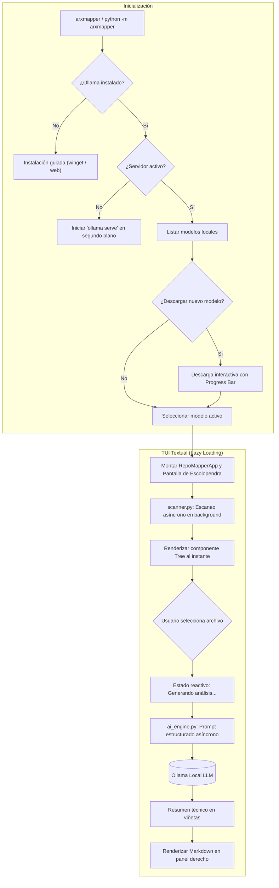

<div align="center">

# 🏛️ ArxMapper CLI

**Terminal User Interface (TUI) interactiva para analizar y documentar la arquitectura de repositorios de código utilizando modelos de IA locales.**

[](https://python.org)
[](https://textual.textualize.io/)
[](https://ollama.com)
[](LICENSE)

[Características](#-características) •
[Arquitectura](#-arquitectura-y-flujo) •
[Instalación](#-instalación) •
[Uso](#-guía-de-uso) •
[Atajos de Teclado](#-atajos-de-teclado) •
[Estructura](#-estructura-del-proyecto) •
[Roadmap](ROADMAP.md)

</div>

---

## 💡 ¿Qué es ArxMapper?

**ArxMapper** es una herramienta de terminal moderna y reactiva diseñada para desarrolladores, arquitectos de software y líderes técnicos que necesitan comprender la estructura de proyectos de software de forma rápida, privada y sin incurrir en costes de APIs externas.

Conectado directamente a **Ollama**, ArxMapper examina el código fuente localmente y genera en tiempo real un informe arquitectónico estructurado con tres ejes fundamentales:
1. 🎯 **Responsabilidad del Módulo:** Propósito esencial y rol en el sistema.
2. 📦 **Dependencias Clave:** Acoplamientos externos e internos críticos.
3. 🏛️ **Patrones Arquitectónicos y de Diseño:** Patrones observados (Clean Architecture, MVC, Repository, Factory, etc.) y principios SOLID.

---

## ✨ Características Principales

- 🖥️ **Interfaz Visual TUI Dividida:** Construida con `Textual`, ofrece un panel de exploración en árbol a la izquierda y un visor `Markdown` con scroll a la derecha.
- ⚡ **Regla Estricta de Carga Perezosa (Lazy Loading):** Inicio instantáneo del árbol. Ningún archivo se envía al LLM hasta que el usuario lo selecciona con el teclado o ratón.
- 🔒 **Privacidad Total (100% Offline):** Utiliza modelos locales mediante la librería oficial de `ollama`. Tu código nunca abandona tu máquina.
- 🧹 **Filtrado Inteligente de Directorios:** Ignora automáticamente carpetas ruidosas (`node_modules/`, `.git/`, `venv/`, `target/`, `.idea/`, artefactos de compilación y archivos binarios).
- 🧭 **Asistente de Inicialización (Onboarding Wizard):**
  - Detecta si Ollama está instalado en el sistema (ofreciendo instalación automática en Windows vía `winget`).
  - Lista los modelos disponibles localmente.
  - Ofrece un catálogo curado de modelos recomendados para análisis de código (`qwen2.5-coder`, `llama3.2`, `codellama`) con descarga guiada y barra de progreso interactiva.
- 🐛 **Pantalla de Carga Animada (Escolopendra):** Renderizado progresivo línea por línea con `set_interval` mientras un worker en segundo plano (`@work` / `asyncio.to_thread`) indexa el repositorio (proyectos Spring Boot, Python, etc.) sin congelar la interfaz.
- 🚀 **Asincronía Total sin Bloqueos:** El análisis se ejecuta en workers de segundo plano (`@work(exclusive=True)`), permitiendo navegar por la interfaz sin congelar la terminal.

---

## 📐 Arquitectura y Flujo



---

## 📦 Instalación

### Prerrequisitos
- **Python 3.10+**
- **Ollama** ([Descargar Ollama](https://ollama.com/download))

### 1. Clonar el repositorio
```bash
git clone https://github.com/sergiomrtnez/arxmapper-cli.git
cd arxmapper-cli
```

### 2. Crear un entorno virtual (opcional pero recomendado)
```bash
# En Windows (PowerShell)
python -m venv venv
.\venv\Scripts\Activate.ps1

# En Linux / macOS
python3 -m venv venv
source venv/bin/activate
```

### 3. Instalar dependencias o instalar en modo desarrollo
```bash
pip install -r requirements.txt

# Opcional: instalar comando globalmente en tu entorno editable
pip install -e .
```

---

## 🚀 Guía de Uso

### Ejecución Directa
Para analizar el directorio actual:
```bash
# Si se instaló con pip install -e .
arxmapper

# O mediante ejecución modular de Python:
python -m arxmapper

# O ejecutando el script directamente:
python src/arxmapper/app.py
```

> [!TIP]
> Si la terminal no reconoce el comando directo `arxmapper` (por ejemplo, si el directorio `Scripts` de Python no está en el `PATH` del sistema), puedes utilizar siempre `python -m arxmapper`.

### Analizar otro proyecto o repositorio
Puedes especificar la ruta de cualquier carpeta o repositorio mediante el flag `-p` o `--path`:
```bash
arxmapper --path C:/ruta/a/mi-proyecto
# o: python -m arxmapper --path C:/ruta/a/mi-proyecto
```

### Opciones CLI Disponibles

| Parámetro | Argumento | Descripción |
| :--- | :--- | :--- |
| `-p`, `--path` | `RUTA` | Ruta del directorio a explorar (por defecto: `.`). |
| `-m`, `--model` | `NOMBRE` | Nombre del modelo de Ollama a utilizar directamente. |
| `--no-wizard` | Flag | Omite el asistente de terminal previo e inicia la TUI de inmediato. |

**Ejemplo de inicio rápido sin asistente:**
```bash
arxmapper -p ../otro-repo -m qwen2.5-coder:7b --no-wizard
```

---

## ⌨️ Atajos de Teclado

| Tecla | Acción |
| :---: | :--- |
| `↑` / `↓` | Navegar verticalmente por el esquema de módulos y componentes. |
| `Enter` / `Click` | **En módulo/carpeta:** Expandir/contraer y mostrar su ficha arquitectónica en el panel derecho.<br>**En archivo/componente:** Lanzar análisis arquitectónico con IA (Lazy Loading). |
| `e` | **Expandir todo:** Abre recursivamente todos los niveles del esquema de módulos. |
| `c` | **Colapsar todo:** Repliega los submódulos a la raíz del esquema. |
| `r` | **Recargar esquema:** Vuelve a escanear el repositorio y reconstruir el mapa. |
| `t` | **Alternar tema:** Cambia entre modo oscuro y claro de Textual. |
| `q` | **Salir:** Cierra la aplicación TUI. |

---

## 📂 Estructura del Proyecto

```text
arxmapper-cli/
├── src/
│   └── arxmapper/
│       ├── __init__.py         # Inicializador y metadatos del paquete arxmapper
│       ├── __main__.py         # Punto de entrada para ejecución modular (python -m arxmapper)
│       ├── app.py              # Punto de entrada, TUI Textual (Tree + Markdown), lazy loading y wizard
│       ├── scanner.py          # Explorador jerárquico con pathlib y filtros de exclusión
│       └── ai_engine.py        # Conector Ollama (AsyncClient), gestión de modelos y prompts
├── pyproject.toml              # Configuración de empaquetado del proyecto CLI (setuptools / PEP 621)
├── requirements.txt            # Dependencias mínimas (textual, ollama, rich)
├── LICENSE                     # Licencia de código abierto MIT
├── ROADMAP.md                  # Hoja de ruta y tareas pendientes priorizadas
└── README.md                   # Documentación completa del proyecto
```

### Descripción de Módulos:
- **`__init__.py`**: Inicializa el paquete Python y expone las clases principales (`AIEngine`, `RepoScanner`) y la versión del paquete (`__version__`).
- **`__main__.py`**: Facilita la invocación directa del paquete como ejecutable (`python -m arxmapper`).
- **`app.py`**: Orquesta la experiencia de usuario completa. En terminal ofrece el asistente de verificación de modelos y en la TUI implementa una arquitectura reactiva basada en eventos, la pantalla de carga animada (escolopendra) y workers concurrentes exclusivos.
- **`scanner.py`**: Aísla por completo la interacción con el sistema de archivos. Filtra `.git`, `node_modules`, `venv`, artefactos binarios y de compilación (`*.egg-info`, `dist/`, `build/`), gestionando lecturas con codificación segura (`utf-8` con reemplazo).
- **`ai_engine.py`**: Administra la comunicación con Ollama mediante `AsyncClient`, previene bloqueos del event loop, formula el prompt arquitectónico estructurado y captura incidencias de red o modelos inexistentes.

---

## 🤝 Contribuciones

¡Las contribuciones son bienvenidas! Si deseas mejorar los filtros del escáner, añadir nuevos modelos recomendados o expandir las plantillas de análisis:

1. Haz un Fork del proyecto.
2. Crea tu rama de funcionalidad (`git checkout -b feature/nueva-mejora`).
3. Realiza tus commits (`git commit -m 'feat: añadir soporte para X'`).
4. Haz push a la rama (`git push origin feature/nueva-mejora`).
5. Abre un **Pull Request**.

---

## 📄 Licencia

Distribuido bajo la Licencia MIT. Consulta el archivo [LICENSE](LICENSE) para más detalles.
